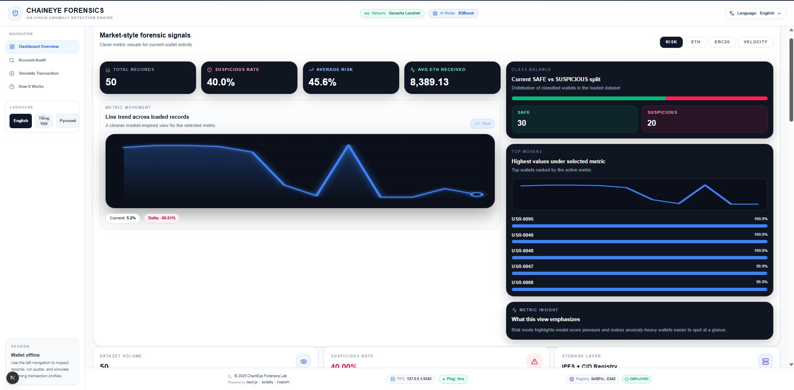
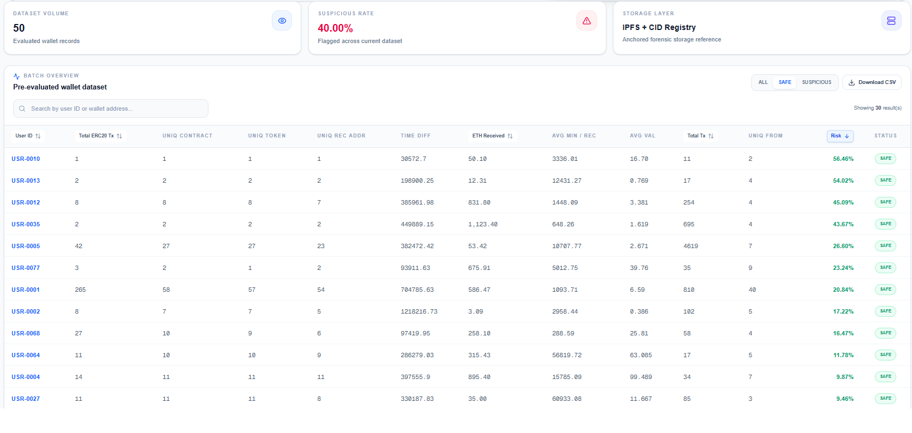
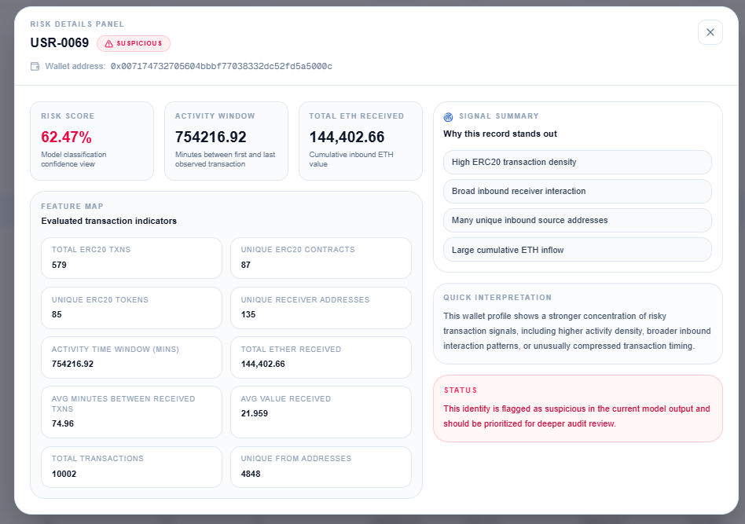
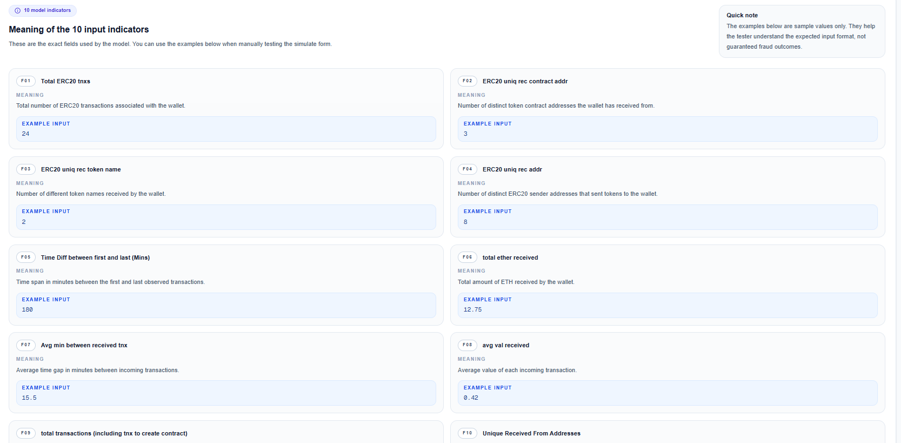

<h1 align="center">Welcome to ChainEye Forensics 👋</h1>
<p align="center">
  
  
  <a href="https://github.com/ngocleltt/fraud-detect-dapp-mvp">
    
  </a>
  <a href="https://github.com/YOUR_USERNAME/fraud-detect-dapp-mvp/blob/main/LICENSE">
    
  </a>
  
  
  
  
  
</p>

> An AI-powered DApp MVP for detecting suspicious behavior and anomalies in blockchain networks based on transaction analysis.

## ✨ Demo

ChainEye Forensics analyzes wallet transactions using an XGBoost model trained on 10 key features:

<p align="center">
  
</p>

<p align="center">
  
</p>
<p align="center">
  
</p>

<p align="center">
  
</p>


---
### Project structure

```plaintext
fraud-detect-dapp-mvp/
├── backend/
│   ├── main.py              # FastAPI application
│   ├── ipfs_cids.json       # CID registry cache (auto-generated)
│   └── .env                 # Environment variables (PINATA_JWT, etc.)
├── frontend/
│   ├── app/
│   │   ├── page.tsx         # Main application
│   │   ├── components/      # React components
│   │   ├── locales/         # i18n (EN, VI, RU)
│   │   └── utils/           # Helper functions (contract.ts, etc.)
│   └── package.json
├── model/
│   ├── train_fraud_model.py # Model training script
│   ├── fraud_model.pkl      # Trained model artifact
│   ├── plots/               # Evaluation visualizations
│   └── transaction_dataset.csv
├── contract/
│   └── CidStorage.sol  # Smart contract for CID storage
└── README.md
```

---
## 🎯 10 Features for Fraud Detection

| # | Feature | Description |
|---|---------|-------------|
| 1 | `Total ERC20 tnxs` | Total number of ERC20 transactions |
| 2 | `ERC20 uniq rec contract addr` | Unique recipient contract addresses |
| 3 | `ERC20 uniq rec token name` | Unique token names received |
| 4 | `ERC20 uniq rec addr` | Unique recipient addresses |
| 5 | `Time Diff between first and last (Mins)` | Time span of activity in minutes |
| 6 | `total ether received` | Total ETH received |
| 7 | `Avg min between received tnx` | Average minutes between transactions |
| 8 | `avg val received` | Average transaction value received |
| 9 | `total transactions (including tnx to create contract)` | Total transactions including contract creation |
| 10 | `Unique Received From Addresses` | Number of unique senders |

## 🚀 Installation

### Prerequisites

- Node.js (v16+)
- Python 3.9+
- npm or yarn
- MetaMask or any Web3 wallet (for blockchain interaction)
- Pinata account (for IPFS storage)

### Clone the repository

```sh
git clone https://github.com/YOUR_USERNAME/fraud-detect-dapp-mvp.git
cd fraud-detect-dapp-mvp
```

### Backend Setup
```sh
cd backend
pip install fastapi uvicorn pandas numpy scikit-learn xgboost imbalanced-learn requests python-dotenv
```

### Start the Backend Server
```sh
cd backend
uvicorn main:app --reload --port 8000
```
The backend API will be available at http://localhost:8000
```sh
INFO:     Started server process
INFO:     Waiting for application startup.
INFO:     Application startup complete.
INFO:     Uvicorn running on http://127.0.0.1:8000
```

### Frontend Application
```sh
cd frontend
npm run dev
```
The frontend will be available at http://localhost:3000

---
## AI model
The fraud detection model is an XGBoost classifier trained with:
- SMOTE (sampling_strategy=0.6) for class imbalance
- GridSearchCV for hyperparameter optimization
- Optimal threshold tuning (default: 0.52)
<p align="center">
  
</p>

---

## 🙏Acknowledgments
- XGBoost - Gradient boosting framework
- FastAPI - Modern Python backend
- Next.js - React framework
- IPFS & Pinata - Decentralized storage
- Ethereum - Smart contract platform
- scikit-learn - ML utilities
- imbalanced-learn - SMOTE implementation
- Tailwind CSS - UI styling
- Lucide Icons - Icon library

---

## 👤Author
- **Ngoc Le** - [@ngocleltt](https://github.com/ngocleltt)
- **Hieu Pham** - [@H1eu10](https://github.com/H1eu10)
- **Ngu Giang** - [@ngugiang](https://github.com/ngugiang)
---
## 📝License
Copyright © 2026 ngocleltt.
This project is MIT licensed.